# Pipeline overview

This is the cross-subsystem map of the ENet/LightM-UNet FPGA-compression pipeline: architecture search → FP32 training → sensitivity analysis → joint bit-width/folding ILP → QAT fine-tuning → QONNX export → FINN hardware build → FPGA deployment. Today this chain exists only as hand-run scripts, SLURM jobs, and shared CSV/`.env` handoffs — no shared artifact schema, no DAG runner. This document formalizes it as a pipeline of processes and artifact interfaces so it can eventually be automated.

For implementation detail (CLI flags, Docker/Vivado environment setup, per-script usage), see `compression/README.md` and `hardware/README.md`. This document stays at the artifact/interface level.

The machine-readable twin of the table below is [`pipeline/stages.yaml`](pipeline/stages.yaml).

`[PLACEHOLDER: new]` = no script/artifact exists today. `[PLACEHOLDER: rework]` = code exists but needs real changes before it fulfills this role.

## Diagram

```mermaid
flowchart TD
    subgraph PHASE0["Phase 0 — Architecture & Training (enet/, compression/slurm/)"]
        A0["Arch/Config Selection\n[MANUAL today — ENET_* env vars\nchosen by hand, no artifact]"] -->|"arch_config\n(ENET_* env vars)"| A1
        A1["[PLACEHOLDER: new]\nGenerate Training Job\n(today: hand-authored\ncompression/slurm/*.job)"] -->|"stage_<name>.job\n(SLURM script)"| A2
        A2["Preprocess Dataset\nnnUNetv2_plan_and_preprocess"] -->|"nnUNet_preprocessed/<Dataset>/\n(plans.json, npy/npz)"| A3
        A3["Train Model FP32\nnnUNetv2_train -tr nnUNetTrainerENet*\n(SLURM job, GPU)"] -->|"checkpoint_best.pth\n(+ plans.json, dataset.json)"| A4
        A4["Archive + Log\nscripts/archive_checkpoint.sh\ncompression/collect_results.py"] -->|"$MODELS_ARCHIVE_DIR/<trainer>_<dataset>_<ts>/\n+ row in compression/results.csv"| B1
    end

    subgraph PHASE1["Phase 1 — Compression (compression/MILP/)"]
        B1["Layer Sensitivity Analysis\nlayer_sensitivity.py (GPU)"] -->|"layer_sensitivity_<config>.json"| B2
        B2["Bit-width Search + Folding ILP\nfinn_milp.py (5-alpha sweep)"] -->|"layer_bits_folding_<config>_alpha<A>.json\n+ run_args.json + summary.csv"| B3
        B2 -.->|"layer_bits_folding_..._alpha0.25.json"| B2b
        B2b["Naive Uniform-Bit Baseline\nuniform_bits_same_folding.py"] -->|"layer_bits_folding_<config>_uniform.json"| C0
        B3["Expand to Quantizer Sites\nexpand_layer_bits.py"] -->|"layer_bits_SITES_<config>.json\n(~101 weight + ~126 act sites)"| B4
        B4["QAT Fine-tune (INT)\nnnUNetTrainerLayerQuantENet_*_perlayer\n(nnUNetv2_train, GPU)"] -->|"checkpoint_best.pth (INT)\nnew trainer-named results folder"| C0
    end

    subgraph PHASE2["Phase 2 — HW Export & Build (hardware/, FINN docker + Vivado)"]
        C0["Export to QONNX\nfinn_export_*_trained.py\n(--checkpoint, --bits-file)"] -->|"quantEnet_<config>_int8.onnx"| C1
        C1["Conv-Order Mapping\nfinn_hawq_dump_conv_order_*.py"] -->|"conv-order map (json/csv)"| C2
        C2["Streamline / Convert-to-HW / Partition\nfinn_hawq_preamble_*_trained.py\n(FINN docker container)"] -->|"finn_deployment_outputs/*_preamble_*/\n(8-way partitioned ONNX)"| C3
        C3["Per-Partition IP-Gen / Stitch\nfinn_ooc_*_8way_full.py\n(Vivado, parallel per partition)"] -->|"stitched IP per partition"| C4
        C4["OOC Synthesis + RTL Sim\nfinn_ooc_*_8way_per_partition_synth.py"] -->|"LUT/BRAM/DSP/timing reports\n+ rtlsim performance"| C5
        C4 -.->|"mvau_lut_calibration_dataset.csv\nmvau_lut_correlation_report.txt"| B2
        C5["Full Bitstream Build (Zynq)\nfinn_zynqbuild_*_partition0.py"] -->|"deploy/ : bitfile(.bit), .hwh/.xsa,\ndriver.py, driver_base.py, runtime_weights/"| D1
    end

    subgraph PHASE3["Phase 3 — Deployment & FPGA Inference"]
        D1["[PLACEHOLDER: new]\nDeploy Package to SoC\n(copy deploy/ artifacts to board)"] -->|"bitfile + FINN IP loaded\non Zynq PL"| D2
        D2["[PLACEHOLDER: rework]\nBare-metal lwIP TCP Server\ndeployment/baremetal/lwip/run.c\nport 7, FXD/FDXD framed protocol\n**needs rewiring from current\nunrelated kernel to segmentation IP**"] -->|"framed result bytes\n(FDXD header + pixels)"| D3
        D3["[PLACEHOLDER: new]\nFPGA Client (host side)\ndeployment/image_transfer_interface/\n(currently EMPTY — talks FXD/FDXD\nprotocol to run.c over TCP port 7)"] --> END(["Result delivered to host"])
    end

    subgraph EVAL["Cross-cutting: Evaluation (analysis/501_ARCADE/)"]
        E1["Accuracy/Topology Eval\ndice / clDice / topology metrics"]
    end
    A3 -.->|"checkpoint"| E1
    B4 -.->|"checkpoint (INT)"| E1
    D3 -.->|"result tensor"| E1
```



Solid arrows = real forward artifact flow. Dotted arrows = feedback loops (calibration data back into the cost model) or cross-cutting consumption (evaluation).

## Per-stage interface table

| # | Stage | Process | Input artifact(s) | Output artifact(s) | Notes |
|---|-------|---------|--------------------|---------------------|-------|
| 0 | Arch/Config Selection | Manual — `ENET_*` env vars chosen by hand, trainer class picked by name | Prior best-config handoff (optional): `compression/configs/best_model.env` | `ENET_*` env var set (no persisted artifact today) | No script exists; candidate for future `generate_arch_config.py` |
| 1 | Generate Training Job | `[PLACEHOLDER: new]` generator — today hand-authored `compression/slurm/stage_<N>_<name>.job` | arch config (stage 0) | `compression/slurm/<job>.job` (SLURM script) | Formalizes the "Generate Training script" concept |
| 2 | Preprocess Dataset | `nnUNetv2_plan_and_preprocess -d <ID> --verify_dataset_integrity` | raw dataset under `nnUNet_raw/<Dataset>` | `nnUNet_preprocessed/<Dataset>/{plans.json, npz/npy}` | Once per dataset, not per config; no GPU needed |
| 3 | Train Model FP32 | `nnUNetv2_train <Dataset> 2d <fold> -tr nnUNetTrainerENet<Variant> [--c]` (SLURM job) | preprocessed data + `ENET_*` env vars | `checkpoint_{best,final,latest}.pth`, `plans.json`, `dataset.json`, `debug.json` under `$nnUNet_results/<Dataset>/<Trainer>__<Plans>__<config>/fold_<N>/` | GPU + SLURM; self-heal-checkpoint logic; `--c` resumes |
| 4 | Archive + Log | `scripts/archive_checkpoint.sh <Dataset> <Trainer> [Config] [Fold] [Plans]`, `compression/collect_results.py` | checkpoint (stage 3) | `$MODELS_ARCHIVE_DIR/<trainer>_<dataset>_<timestamp>/`; appended row in `compression/results.csv` | Checkpoints are gitignored; archive dir + CSV are the durable record |
| 5 | Layer Sensitivity Analysis | `compression/MILP/layer_sensitivity.py --net-name --checkpoint-name checkpoint_best.pth --fold --dataset-name --configuration 2d --plans-name nnUNetPlans --n-batches --n-probes --config --candidate-bits` | FP32 checkpoint + preprocessed data | `layer_sensitivity_<config>.json` (~101 layers for S12) | GPU; runs the plain FP32 model (not Brevitas) to avoid double-backward through fake-quant |
| 6 | Bit-width Search + Folding ILP | `compression/MILP/finn_milp.py --config --sensitivity-file --candidate-bits --alpha --hard-lut-fraction --hard-bram-fraction --hard-dsp-fraction --hard-uram-fraction --force-dsp --force-serial --allow-lut-mult --require-simd-ge-pe --max-latency-ms --clock-mhz --time-limit --gap-rel [--pin-bits-file]` | `layer_sensitivity_<config>.json`, `config_<name>.py` | `layer_bits_folding_<config>_alpha<A>.json`, `run_args.json`, `summary.csv` | CPU ILP solver (PuLP/CBC); run once per alpha in a 5-point sweep (0.0/0.25/0.5/0.75/1.0) |
| 6b | Naive Uniform-Bit Baseline | `compression/MILP/uniform_bits_same_folding.py` | one alpha's `layer_bits_folding_*.json` (observed: alpha=0.25) | `layer_bits_folding_<config>_uniform.json` | Keeps folding, forces uniform bits, recomputes cost — comparison baseline only |
| 7 | Expand to Quantizer Sites | `compression/MILP/expand_layer_bits.py` | `layer_bits_folding_<config>_alpha<A>.json` | `layer_bits_SITES_<config>.json` (~101 weight + ~126 act sites for S12) | Bridges ILP's one-bit-pair-per-conv-layer schema to per-quantizer-site schema the QAT trainer needs |
| 8 | QAT Fine-tune (INT) | `nnUNetv2_train ... -tr nnUNetTrainerLayerQuantENet_<variant>_perlayer` (SLURM array job) | `layer_bits_SITES_<config>.json` + warm-start FP32 checkpoint | new `checkpoint_best.pth` (INT) under new trainer-named results folder | GPU; `expand_layer_bits.py` invocation deliberately deferred to this job's own step 0 in the observed workflow |
| 9 | Export to QONNX | `hardware/finn_export_<config>_..._trained.py` (built on `export_quant_checkpoint.py` / `finn_enet_prod_export.py`'s `FINNQuantENet` base) | INT checkpoint (stage 8) + `layer_bits_SITES_*.json` (`--bits-file`, `--checkpoint`) | `hardware/outputs/finn_exports/quantEnet_<config>_..._int8.onnx` | Arch looked up via `compression/results.csv` by `--net-name`; fixes FINN incompatibilities (no asymmetric convs, no MaxUnpool/interpolate) |
| 10 | Conv-Order Mapping | `hardware/finn_hawq_dump_conv_order_*.py` | ONNX (stage 9) + bits JSON | conv-order mapping file | Maps HAWQ bit assignments to ONNX node order |
| 11 | Streamline / Convert-to-HW / Partition | `hardware/finn_hawq_preamble_*_trained.py` (wraps `finn_enet_build.py`'s `step_enet_tidy`/`step_enet_streamline`/`step_enet_convert_to_hw`) | ONNX + conv-order map | `hardware/outputs/finn_deployment_outputs/*_preamble_*/` (8-way partitioned ONNX) | **Runs inside FINN Docker container**, not the repo's normal Python env; no Vivado yet |
| 12 | Per-Partition IP-Gen / Stitch | `hardware/finn_ooc_..._8way_full.py` | partitioned ONNX (stage 11) | stitched IP per partition | Vivado; parallelizable across 8 partitions |
| 13 | OOC Synthesis + RTL Sim | `hardware/finn_ooc_..._8way_per_partition_synth.py` | stitched IP (stage 12) | LUT/BRAM/DSP/timing reports, rtlsim performance | Vivado OOC synth; feeds `mvau_lut_calibration_dataset.csv`/`mvau_lut_correlation_report.txt` back into `finn_cost_model.py` (feedback loop, not a forward dependency) |
| 14 | Full Bitstream Build (Zynq) | `hardware/finn_zynqbuild_..._partition0.py` (`DataflowBuildConfig`, `steps=[...,"step_synthesize_bitfile","step_make_pynq_driver","step_deployment_package"]`) | partitioned ONNX (partition0) + build config | `deploy/`: bitfile (`.bit`), `.hwh`/`.xsa`, `driver.py`, `driver_base.py`, optional `runtime_weights/` | Vivado; long-running; full PS+PL build |
| 15 | Deploy Package to SoC | `[PLACEHOLDER: new]` — no script found; presumably manual today | `deploy/` package (stage 14) | bitfile loaded onto Zynq PL, IP live on the SoC | Needs a defined transfer mechanism |
| 16 | Bare-metal lwIP TCP Server | `[PLACEHOLDER: rework]` `deployment/baremetal/lwip/run.c` — TCP server on Zynq PS, port 7, FXD/FDXD framed protocol, state machine `WAIT_HEADER→WAIT_PIXELS→SEND_TO_PL→PROCESS→RECV_FROM_PL→SEND_HEADER→WAIT_ACK→SEND_PIXELS`, `XAxiDma` | framed image bytes from host client (stage 17) via TCP | framed result bytes back to host client | **Chosen target transport.** Currently wired to an unrelated accelerator (`XGrid_filter`/`XScatter`/`XMedian_filter`/`XCorrect`) — must be rewired to drive the segmentation FINN IP before this stage is real. `deployment/finn/check_pixel_counts.py` already computes the expected byte counts (4096 in / 24576 out) this server must handle |
| 17 | FPGA Client (host side) | `[PLACEHOLDER: new]` — target location `deployment/image_transfer_interface/` (currently an **empty directory**) | host-side image/tensor to send | received result tensor/image + latency log on host | Speaks the FXD/FDXD framed protocol to `run.c` over TCP port 7; this is the pipeline's final stage |
| EVAL | Accuracy/Topology Evaluation (cross-cutting) | `analysis/501_ARCADE/` dice/clDice/topology scripts | checkpoint (FP32 or INT) or on-board result tensor | metrics report (csv/json) | Not a linear stage — independently consumes artifacts from stages 3, 8, and 17 for cross-pipeline comparison |

## Artifact-manifest convention

`compression/MILP/finn_milp.py` already writes a `run_args.json` next to its outputs (e.g. `compression/MILP/artifacts/S12_ILP_outputs_perlayer_forcedsp_lut70/run_args.json`), including a `"pipeline"` field naming upstream/downstream scripts. The convention below generalizes that pattern rather than inventing a new one.

**Convention**: one sidecar manifest per artifact, same basename + `.manifest.json` (e.g. `layer_bits_folding_12_dense_relu_alpha0.5.json` → `...alpha0.5.manifest.json`; also applies to binary artifacts like checkpoints/ONNX/bitfiles: `checkpoint_best.pth.manifest.json`).

```json
{
  "schema_version": "1.0",
  "artifact_id": "layer_bits_folding_12_dense_relu_alpha0.5",
  "stage": "bitwidth_search_folding_ilp",
  "produced_by": {
    "script": "compression/MILP/finn_milp.py",
    "git_commit": "<sha>",
    "invocation_args": {"config": "config_12_dense_relu.py", "alpha": 0.5, "candidate_bits": "4,6,8"},
    "environment": {"conda_env": "enet-milp", "container": null, "slurm_job_id": "12345678"},
    "timestamp": "2026-09-21T10:00:00Z"
  },
  "inputs": [
    {"artifact_id": "layer_sensitivity_12_dense_relu", "path": "compression/MILP/artifacts/.../layer_sensitivity_12_dense_relu.json", "stage": "layer_sensitivity_analysis"}
  ],
  "outputs": [
    {"path": "layer_bits_folding_12_dense_relu_alpha0.5.json", "kind": "layer_bits_folding"}
  ],
  "status": "success"
}
```

- `stage` uses the fixed vocabulary in [`pipeline/stages.yaml`](pipeline/stages.yaml), so the doc and schema stay in lockstep.
- `inputs[].artifact_id` lets a future DAG runner resolve dependencies from metadata instead of filename-pattern guessing.
- `environment` captures the three real execution contexts in this pipeline: plain conda/SLURM GPU job, FINN Docker container, Vivado toolchain.
- Adoption path: extend `finn_milp.py`'s existing `run_args.json` writer with `inputs`/`outputs`/`artifact_id` first, then roll the sidecar convention out stage-by-stage as scripts are touched anyway — not a big-bang rewrite.

## Target repo layout (proposed)

This section captures a further refinement: rather than leaving `compression/`, `hardware/`, and `deployment/` as-is and only adding docs on top, each main process gets its own directory under a single pipeline root, all processes read/write through one shared `artifacts/` store, and one `configuration.yaml` holds the paths/selections/options for every stage. This is **not** an attempt to build a generalized multi-architecture framework — it targets the current S12 dense ENet build specifically, structured so it stays scalable and understandable rather than because it needs to support other architectures.

```
utils/                         # cross-cutting helpers shared across stages, not stage-specific
  poll_finn_job.py             # reports progress/status of a running FINN docker / Vivado build
                                # job (stages 11-14 are long-running and currently opaque while
                                # in flight — this is the natural home for a progress poller)
  manifest_utils.py            # read/write artifact .manifest.json sidecars (see convention above)
  # candidate future home for consolidating compression/collect_results.py and
  # hardware/collect_results.py (see "Known issues" #3 below)

pipeline/
  configuration.yaml          # single source of truth: paths, dataset/board selection,
                               # per-stage options (candidate bits, alpha sweep, hard-resource
                               # fractions, clock/latency targets, S12-dense-specific constants)
  artifacts/                  # the one shared artifact store every stage reads/writes through
    checkpoints/
    sensitivity/
    bits_folding/
    onnx/
    hw_build/
    deploy/
    eval/
    <artifact>.json
    <artifact>.manifest.json  # per-artifact provenance sidecar (see manifest convention above)
  00_arch_config/              # stage 0 — [PLACEHOLDER: new]
  01_generate_training_job/    # stage 1 — [PLACEHOLDER: new]
  02_preprocess/                # stage 2 — wraps nnUNetv2_plan_and_preprocess
  03_train_fp32/                 # stage 3 — wraps nnUNetv2_train + nnUNetTrainerENet*
  04_archive_log/               # stage 4 — archive_checkpoint.sh + collect_results.py
  05_sensitivity/                # stage 5 — layer_sensitivity.py
  06_bitwidth_folding_ilp/       # stage 6(+6b) — finn_milp.py, uniform_bits_same_folding.py
  07_expand_bits/                # stage 7 — expand_layer_bits.py
  08_qat_finetune/               # stage 8 — nnUNetTrainerLayerQuantENet_*_perlayer
  09_export_qonnx/               # stage 9 — finn_export_*_trained.py
  10_conv_order_map/             # stage 10 — finn_hawq_dump_conv_order_*.py
  11_finn_preamble/              # stage 11 — finn_hawq_preamble_*_trained.py (FINN docker)
  12_partition_stitch/           # stage 12 — finn_ooc_*_8way_full.py (Vivado)
  13_ooc_synth/                  # stage 13 — finn_ooc_*_8way_per_partition_synth.py (Vivado)
  14_zynq_bitstream/             # stage 14 — finn_zynqbuild_*_partition0.py (Vivado)
  15_deploy_to_soc/              # stage 15 — [PLACEHOLDER: new]
  16_lwip_server/                # stage 16 — [PLACEHOLDER: rework] deployment/baremetal/lwip/run.c
  17_fpga_client/                # stage 17 — [PLACEHOLDER: new] deployment/image_transfer_interface/
  eval/                          # cross-cutting — analysis/501_ARCADE/ scripts
```

Each `NN_<stage-name>/` directory holds only that stage's own script(s) (moved from their current home in `enet/`, `compression/`, `hardware/`, or `deployment/`) plus a thin stage-local README; it reads its inputs from and writes its outputs to `pipeline/artifacts/`, and reads its own section of `pipeline/configuration.yaml` for paths/options rather than hardcoded values, `.env` files, or bespoke `config_<name>.py` modules.

**Decided:** auxiliary content that doesn't map 1:1 to a single stage (`hardware/probes/`, `hardware/diag/`, `hardware/archive/`, `deployment/FINN_interface/` Xilinx SDK workspace) stays parked where it is today, untouched by this refactor — it's calibration/debug/historical material, not part of the live stage chain, and doesn't need to live under `pipeline/`.

`configuration.yaml` sketch:

```yaml
dataset:
  name: Dataset509_ARCADE_1x1_4c
  configuration: 2d
  plans_name: nnUNetPlans
  fold: 0
board:
  part: xczu7ev-ffvc1156-2-e
  clock_mhz: 100.0
architecture:
  family: S12_dense_relu          # the one architecture this refactor targets
  channels: [...]
  bottlenecks: [...]
  decoder_type: ...
stages:
  train_fp32:
    trainer_class: nnUNetTrainerENet_12_dense_relu
    epochs: 150
  sensitivity:
    candidate_bits: [4, 6, 8]
    n_batches: ...
    n_probes: ...
  bitwidth_folding_ilp:
    alpha_sweep: [0.0, 0.25, 0.5, 0.75, 1.0]
    hard_lut_fraction: 0.7
    hard_bram_fraction: 1.0
    force_dsp: true
    max_latency_ms: 1000
    time_limit: 300
    gap_rel: 0.02
  # ... one block per remaining stage
paths:
  artifacts_root: pipeline/artifacts/
```

This `configuration.yaml` is static, declarative, per-stage configuration (the target replacement for scattered `.env` files, `config_12_*.py` modules, and hardcoded CLI defaults). It is distinct from the per-artifact `.manifest.json` sidecar above, which is dynamic, per-*run* provenance (what was actually invoked, when, with what git commit) — the two are complementary, not overlapping.

**This layout is a target design, not yet implemented — by decision.** Moving `compression/`, `hardware/`, and `deployment/` content into this structure touches SLURM job scripts (which reference current paths), the FINN Docker container workflow (`hardware/README.md`'s `docker cp`-based deployment of individual `.py` files), and possibly the Xilinx SDK workspace under `deployment/FINN_interface/` — a large, hard-to-reverse move across many interdependent files. This document (plus `pipeline/stages.yaml`) is the reviewable target to work from; the actual migration is deliberately scoped as separate follow-up work, sequenced stage-by-stage starting with the stages that have the fewest external path dependencies, rather than a single big-bang move.

## Known issues (flagged, not yet fixed)

1. **Stale `compression/hawq/` path references** — some SLURM job scripts and `run_args.json`/docstrings still reference the old path, since renamed/consolidated into `compression/MILP/`.
2. **`run.c` wrong-kernel wiring** — the bare-metal lwIP server currently drives an unrelated image-correction accelerator (`XGrid_filter`/`XScatter`/`XMedian_filter`/`XCorrect`), not the segmentation FINN IP. Must be resolved before stages 16/17 above are functionally real.
3. **Duplicated helpers** — `collect_results.py`/`results.csv`/`utils.py`-style helpers are duplicated between `compression/` and `hardware/` rather than shared; the manifest convention above is a natural forcing function to consolidate them later.
4. **`--hard-lut`/`--hard-bram` naming** — actual `finn_milp.py` flags are `--hard-lut-fraction`, `--hard-bram-fraction`, `--hard-dsp-fraction`, `--hard-uram-fraction` (default 1.0), not bare `--hard-lut`/`--hard-bram`.
5. **"Folding check" pass** — no committed script currently runs `--force-serial` together with a hard-LUT cap as a standalone pass. If this should be a real formalized stage, that's a follow-up decision.
